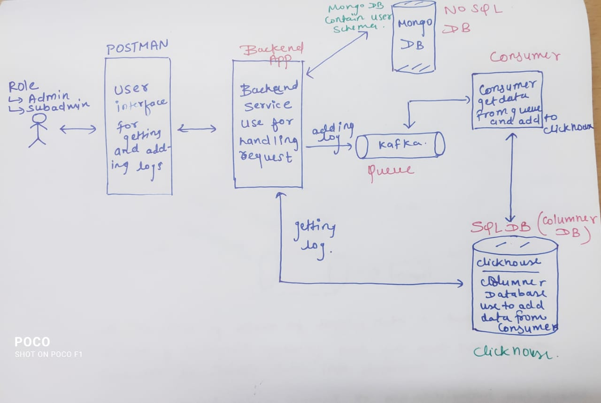

<!-- TABLE OF CONTENTS -->
<details>
  <summary>Table of Contents</summary>
  <ol>
    <li>
      <a href="#about-the-project">About The Project</a>
      <ul>
        <li><a href="#built-with">Built With</a></li>
      </ul>
    </li>
    <li>
      <a href="#getting-started">Getting Started</a>
      <ul>
        <li><a href="#prerequisites">Prerequisites</a></li>
        <li><a href="#installation">Installation</a></li>
      </ul>
    </li>
    <li><a href="#usage">Usage</a></li>
    <li>
      <a href="#details">Details</a>
      <ul>
        <li><a href="#registration">Registration</a></li>
        <li><a href="#login">Login</a></li>
        <li><a href="#add-log">Add Logs</a></li>
        <li><a href="#get-log">Get Logs</a></li>
      </ul>
    </li>
    <li><a href="#license">License</a></li>
    <li><a href="#contact">Contact</a></li>
  </ol>
</details>


<!-- ABOUT THE PROJECT -->
## About The Project



In this context, I've used Node.js as the programming language, leveraging the Express framework as the backend infrastructure. Additionally, for fundamental user-related and permission-based operations, I've integrated MongoDB as the NoSQL database. Furthermore, for the storage and analysis of logs, I've implemented Clickhouse, a columnar-structured SQL database.

<p align="right">(<a href="#readme-top">back to top</a>)</p>


### Built With

* Node.js
* Express.js
* MongoDB (No-SQL DB)
* Clickhouse (Columner - SQL DB)


<p align="right">(<a href="#readme-top">back to top</a>)</p>


<!-- GETTING STARTED -->
## Getting Started

To get a local copy up and running follow these simple steps.

### Prerequisites

This is an example of how to list things you need to use the software and how to install them.
* npm
  ```sh
  npm install npm@latest -g
  ```

### Installation

1. Clone the repo
   ```sh
   git clone https://github.com/dyte-submissions/november-2023-hiring-HRS05.git
   ```
2. Install NPM packages
   ```sh
   npm install
   ```
3. Install kafak and clickhouse (make sure clickhouse is running on port 8123).

4. Run below command in clickhouse cli.
   ```sql
   create database loging;
   use loging;
   CREATE TABLE logs (
        level String,
        message String,
        resourceId String,
        timestamp DateTime('UTC'),
        traceId String,
        spanId String,
        userId String,
        commit String,
        parentResourceId String
    ) ENGINE = MergeTree()
    ORDER BY timestamp;
   ```
    
5. Add environment variable `.env`
   ```env
    API_PORT=3000
    MONGO_URI=

    CLICKHOUSE_HOST=localhost
    CLICKHOUSE_PORT=8123
    CLICKHOUSE_USER=default
    CLICKHOUSE_PASSWORD=

    KAFAK_CLIENTID=my-producer
    KAFKA_BROKER1=localhost:9092   
    LOG_TOPIC=quickstart-events
   ```

<p align="right">(<a href="#readme-top">back to top</a>)</p>


<!-- USAGE EXAMPLES -->
## Usage

The application facilitates user registration with role-based distinctions and provides a login mechanism. Furthermore, it features two distinct endpoints: one for appending logs and another for retrieving all logs, complete with refined filters, including a timestamp-based date range filter.  
For more examples, please refer to the below details.

<p align="right">(<a href="#readme-top">back to top</a>)</p>


<!-- ROADMAP -->
## Details

### Base URL
```
http://localhost:3000
```

### REGISTRATION

```json
/api/user/registerUser
```
* Post request
* Request Json : 
```
{
    "name": "Harsh",
    "age": 23,
    "gender": "M",
    "contactNumber": "7869102999",
    "emailId": "harshjmhr@gmal.com",
    "password": "hihihi",
    "companyId": "shr-83883883",
    "companyName": "sarsh",
    "type": "admin"
}
```

### LOGIN

```json
/api/user/loginUser
```
* Post request
* Request Json : 
```
{
    "emailId" : "harshjmhr@gmal.com",
    "password" : "hihihi"
}
```

### ADD LOG

```json
/api/log/logging
```
* Post request
* Request Json : 
```
{
	"level": "error",
	"message": "Failed to connect to DB",
    "resourceId": "server-1234",
	"timestamp": "2023-09-16T08:00:00Z",
	"traceId": "abc-xyz-123",
    "spanId": "span-456",
    "commit": "5e5342f",
    "metadata": {
        "parentResourceId": "server-0987"
    }
}
```


### GET LOG

```json
/api/log/getLogs
```
* Post request
* Request Json : 
```
{
	"level": "warning",
	"message": "Failed to connect to DB",
    "resourceId": "server-1234",
	"start": "2023-09-15T08:00:00Z",
    "end": "2023-09-17T08:00:00Z",
	"traceId": "abc-xyz-123",
    "spanId": "span-456",
    "commit": "5e5342f",
    "metadata": {
        "parentResourceId": "server-0987"
    }
}
```


# BONUS ON BONUS 
Presently, a singular queue and consumer mechanism are employed for log addition. However, in the scenario where the data volume becomes exceptionally substantial, a more scalable approach involves the incorporation of multiple queues and distinct consumers, orchestrating their utilization in a round-robin fashion.


<p align="right">(<a href="#readme-top">back to top</a>)</p>


<!-- LICENSE -->
## License

Distributed under the MIT License. See `LICENSE.txt` for more information.

<p align="right">(<a href="#readme-top">back to top</a>)</p>


<!-- CONTACT -->
## Contact

Email: harshjmhr@gmail.com  
Linkedin: https://www.linkedin.com/in/harsh-sharma-531181181/

<p align="right">(<a href="#readme-top">back to top</a>)</p>


<!-- MARKDOWN LINKS & IMAGES -->
<!-- https://www.markdownguide.org/basic-syntax/#reference-style-links -->
[contributors-shield]: https://img.shields.io/github/contributors/github_username/repo_name.svg?style=for-the-badge
[contributors-url]: https://github.com/github_username/repo_name/graphs/contributors
[forks-shield]: https://img.shields.io/github/forks/github_username/repo_name.svg?style=for-the-badge
[forks-url]: https://github.com/github_username/repo_name/network/members
[stars-shield]: https://img.shields.io/github/stars/github_username/repo_name.svg?style=for-the-badge
[stars-url]: https://github.com/github_username/repo_name/stargazers
[issues-shield]: https://img.shields.io/github/issues/github_username/repo_name.svg?style=for-the-badge
[issues-url]: https://github.com/github_username/repo_name/issues
[license-shield]: https://img.shields.io/github/license/github_username/repo_name.svg?style=for-the-badge
[license-url]: https://github.com/github_username/repo_name/blob/master/LICENSE.txt
[linkedin-shield]: https://img.shields.io/badge/-LinkedIn-black.svg?style=for-the-badge&logo=linkedin&colorB=555
[linkedin-url]: https://linkedin.com/in/linkedin_username
[product-screenshot]: images/screenshot.png
[Next.js]: https://img.shields.io/badge/next.js-000000?style=for-the-badge&logo=nextdotjs&logoColor=white
[Next-url]: https://nextjs.org/
[React.js]: https://img.shields.io/badge/React-20232A?style=for-the-badge&logo=react&logoColor=61DAFB
[React-url]: https://reactjs.org/
[Vue.js]: https://img.shields.io/badge/Vue.js-35495E?style=for-the-badge&logo=vuedotjs&logoColor=4FC08D
[Vue-url]: https://vuejs.org/
[Angular.io]: https://img.shields.io/badge/Angular-DD0031?style=for-the-badge&logo=angular&logoColor=white
[Angular-url]: https://angular.io/
[Svelte.dev]: https://img.shields.io/badge/Svelte-4A4A55?style=for-the-badge&logo=svelte&logoColor=FF3E00
[Svelte-url]: https://svelte.dev/
[Laravel.com]: https://img.shields.io/badge/Laravel-FF2D20?style=for-the-badge&logo=laravel&logoColor=white
[Laravel-url]: https://laravel.com
[Bootstrap.com]: https://img.shields.io/badge/Bootstrap-563D7C?style=for-the-badge&logo=bootstrap&logoColor=white
[Bootstrap-url]: https://getbootstrap.com
[JQuery.com]: https://img.shields.io/badge/jQuery-0769AD?style=for-the-badge&logo=jquery&logoColor=white
[JQuery-url]: https://jquery.com 
